<div align="center">

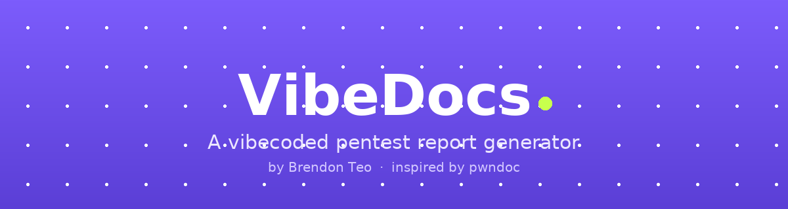

# VibeDocs

### A vibecoded pentest report generator — by Brendon Teo

*Turn messy penetration-test findings into clean, consistent Word & PDF deliverables — locally, in one command.*

[](https://www.docker.com/products/docker-desktop)
[](https://fastapi.tiangolo.com/)
[](https://www.python.org/)
[](LICENSE)
[](https://github.com/pwndoc/pwndoc)

</div>

---

> **VibeDocs** is my take on the report-writing grind every pentester knows too well.
> I got tired of copy-pasting findings, re-numbering screenshots, and re-styling
> the same Word tables, so I vibecoded a tool that does it for me. It manages
> projects, a reusable findings library, CVSS scoring, scan auto-categorization,
> and one-click **Word / PDF** generation with an **Excel risk-register** export —
> all self-hosted, no cloud, no accounts. It's heavily **inspired by
> [pwndoc](https://github.com/pwndoc/pwndoc)**, rebuilt my way in Python.
>
> — *Brendon Teo*

<div align="center">
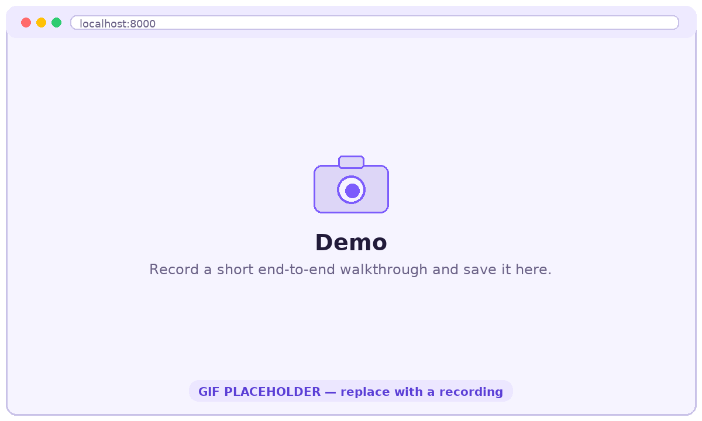
<br><em>↑ Replace with a short screen-recording of generating a report end-to-end.</em>
</div>

---

## ✨ Features

- 📁 **Projects & reports** — organise engagements by client, scope and testing window.
- 🧩 **Report templates** — Web, Infrastructure (VA & VAPT), API, Mobile, Thick Client, Cloud and more. Each ships with its own scope-of-work and methodology.
- 📚 **Findings library** — a reusable, peer-reviewed catalogue so your wording stays consistent. Insert with one click and tailor per report.
- 🧮 **Built-in CVSS calculator** — score findings inline (CVSS 3.0 / 3.1 / 4.0) with live vector + severity, plus a bulk 4.0 → 3.1 re-rate.
- 🤖 **Scan auto-categorization** — import Nessus / Nmap / scan PDFs; VibeDocs categorizes, de-duplicates (CVE-aware) and groups findings for you.
- 📝 **One-click Word & PDF** — generate a polished `.docx` (and PDF via LibreOffice) with screenshots embedded at a consistent width.
- 📊 **Excel risk-register** — export a clean tracker (one row per finding) or import a client-maintained one to sync statuses.
- 🔗 **Combined reports** — merge multiple test types (e.g. Web + API) into one document, each as its own chapter.
- 🔁 **Retest workflow** — dated follow-up entries and per-finding status for a clear remediation trail.
- 🔐 **Secure delivery** — package outputs into an AES-256 encrypted ZIP with reusable per-project passwords.
- 👥 **Roles & review** — admin / senior / consultant / viewer, with a findings-approval and report-review workflow.
- 🔑 **2FA (TOTP)** and an optional SSO scaffold.

---

## 🖼️ Screenshots

> Drop your own captures into `docs/screenshots/` — the filenames below are placeholders.

| Dashboard | Report editor |
|---|---|
| 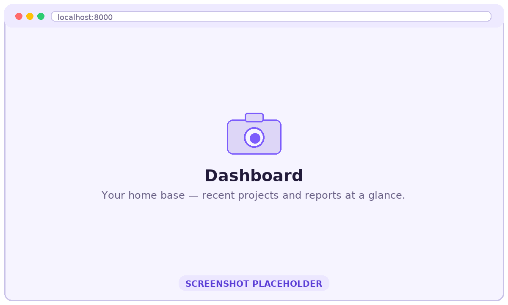 | 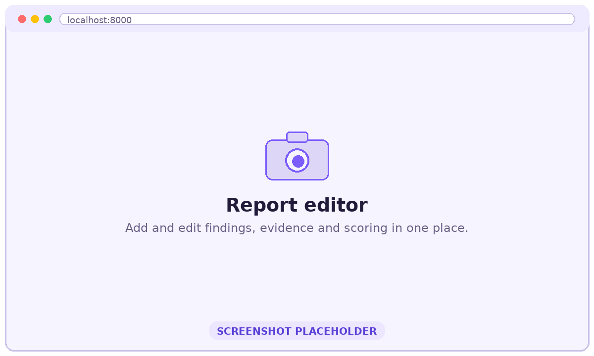 |

| Findings library | CVSS calculator |
|---|---|
| 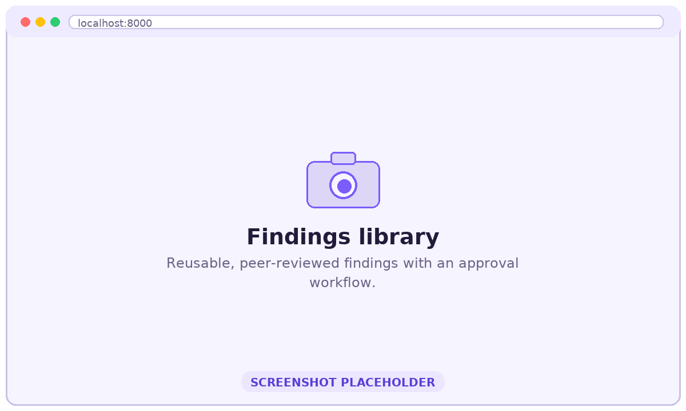 | 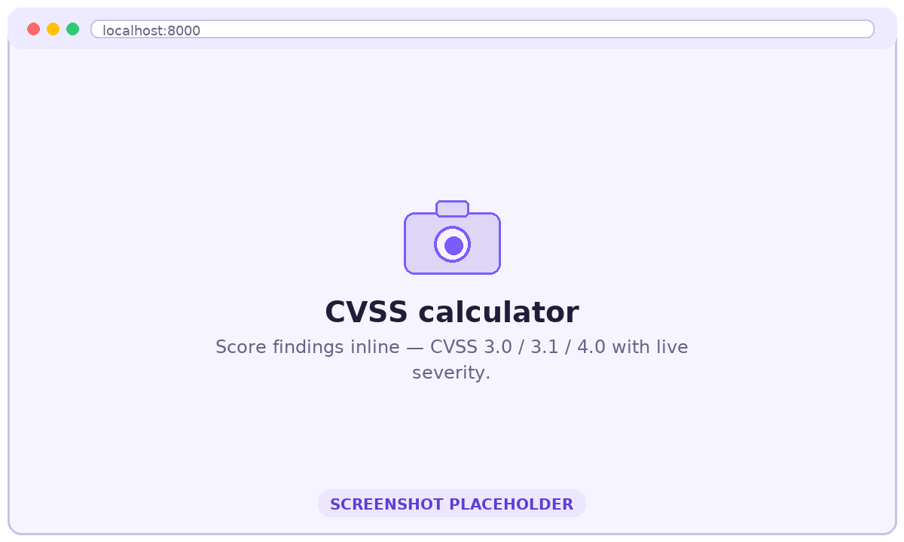 |

| Scan import & categorization | Generated Word report |
|---|---|
| 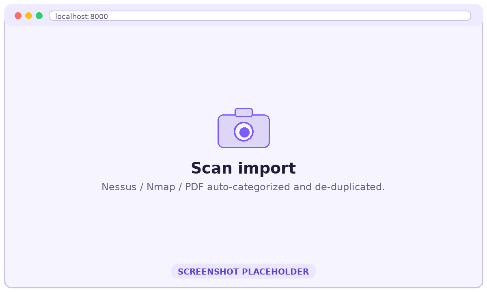 | 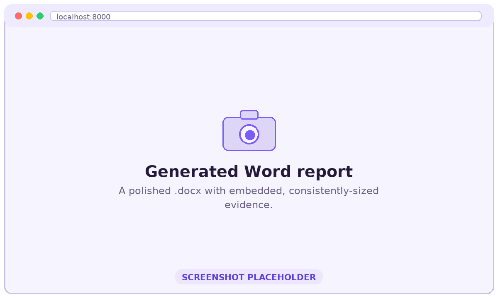 |

---

## 🚀 Quick Start

You only need **[Docker Desktop](https://www.docker.com/products/docker-desktop)**. Nothing else.

### Windows (one click)
1. Install & start Docker Desktop.
2. Download this repo (green **Code → Download ZIP**, or `git clone`).
3. Double-click **`START.cmd`**.

It builds everything, seeds the database, and opens <http://localhost:8000>.

### macOS / Linux
```bash
git clone https://github.com/<your-username>/VibeDocs.git
cd VibeDocs
./start.sh
```

### Any platform (manual)
```bash
docker compose up -d --build
# then open http://localhost:8000
```

**First login:** `admin` / `change_me_now` — change it immediately under your profile.

<div align="center">
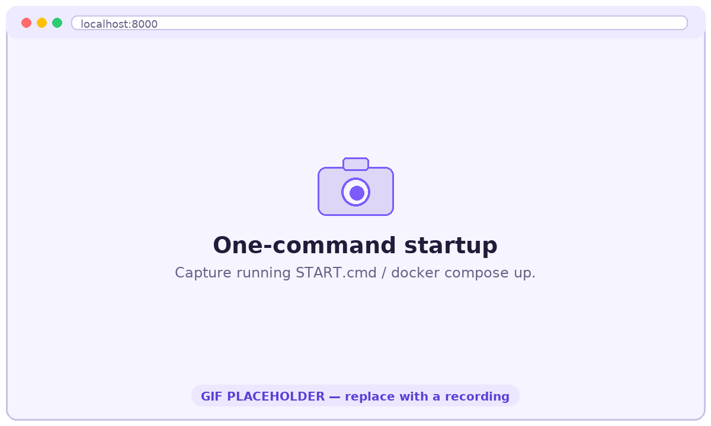
<br><em>↑ Replace with a GIF of running START.cmd / docker compose up.</em>
</div>

### Everyday controls

| Windows | Command line | What it does |
|---|---|---|
| `START.cmd` | `docker compose up -d` | Start VibeDocs |
| `STOP.cmd`  | `docker compose down` | Stop (keeps your data) |
| `LOGS.cmd`  | `docker compose logs -f app` | Watch live logs |
| `RESET.cmd` | `docker compose down -v` | **Wipe all data** and start fresh |

Also included: **Mailpit** at <http://localhost:8025> — a local inbox that catches password-reset emails so everything works without configuring real mail.

---

## 📖 How to use it

A typical engagement, start to finish:

1. **Create a project** — client, scope targets (URLs / IPs), testing window.
   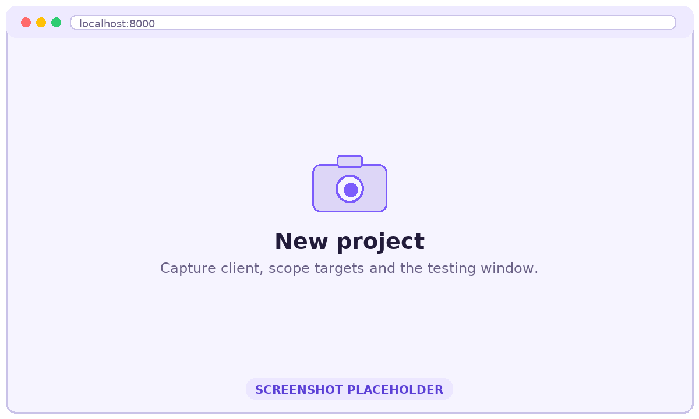
2. **Add a report** and pick the matching template (Web / Infra / API / …).
3. **Fill report details** — testers, tools used, credentials, dates.
4. **Add findings** — from the library, manually, or by importing a scan.
   <div align="center">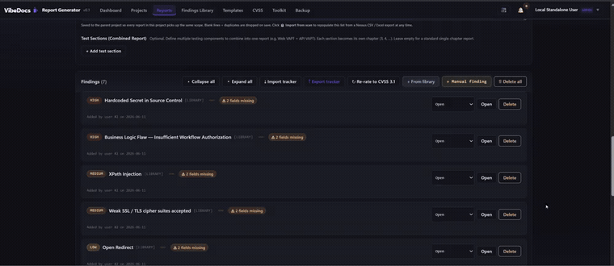</div>
5. **Score with the CVSS calculator** and attach screenshots (auto-sized in Word).
6. **Generate** a DRAFT for review, then the clean FINAL — as Word, PDF, or an encrypted ZIP.
   <div align="center">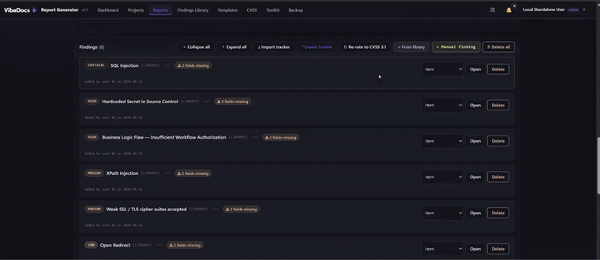</div>
7. **Export the Excel tracker** for the client, and after remediation, spin up a **Retest** version.

---

## 🧰 Tech stack

- **Backend:** Python 3.12 · FastAPI · SQLAlchemy · Jinja2
- **Documents:** `python-docx` (Word) · `openpyxl` (Excel) · LibreOffice (PDF)
- **Database:** PostgreSQL 16
- **Frontend:** server-rendered Jinja templates + a dash of HTMX & vanilla JS
- **Packaging:** Docker Compose (app + Postgres + Mailpit)

---

## 📂 Project structure

```
VibeDocs/
├── START.cmd / STOP.cmd / LOGS.cmd / RESET.cmd   # Windows one-click controls
├── start.sh                                       # macOS / Linux launcher
├── docker-compose.yml                             # the whole stack
├── backend/
│   ├── Dockerfile
│   ├── requirements.txt
│   └── app/                                        # FastAPI application
│       ├── main.py  models.py  schemas.py  seed.py
│       ├── routers/                                # API + page routes
│       ├── services/                               # docx/excel/cvss/scan engines
│       └── templates/  static/                     # UI
├── word_templates/        # generated on first boot (ships empty)
└── report-templates/      # tracker layouts (synthesised if empty)
```

---

## ⚙️ Configuration

Everything works out of the box. To customise, create a `.env` (the Windows
launcher writes one for you with unique secrets). Common settings:

| Variable | Default | Purpose |
|---|---|---|
| `APP_PORT` | `8000` | Host port for the web app |
| `MAILPIT_UI_PORT` | `8025` | Host port for the local mail inbox |
| `SECRET_KEY` | _(generated)_ | Session signing key — set a long random value |
| `POSTGRES_PASSWORD` | _(generated)_ | Database password |
| `AUTH_PROVIDER` | `local` | `local` accounts, or `oidc` for SSO |
| `SMTP_HOST` | `mailpit` | Point at a real relay (Gmail, M365, SES) for live email |

---

## ❓ FAQ

**Is my data sent anywhere?** No. VibeDocs runs entirely on your machine; data lives in local Docker volumes.

**Port 8000 already in use?** Set `APP_PORT=8088` in `.env` and use <http://localhost:8088>.

**Where are the templates?** The app generates starter Word templates on first boot and synthesises a clean Excel tracker, so the repo ships with empty template folders. Drop in your own branded `.docx` later — keep the same Jinja placeholders.

**How do I start over?** `RESET.cmd` (or `docker compose down -v`), then `START.cmd`.

---

## 🙏 Credits

VibeDocs is **inspired by [pwndoc](https://github.com/pwndoc/pwndoc)** by yeznmel — the
project that proved collaborative, template-driven pentest reporting could be
pleasant. VibeDocs is an independent reimplementation in Python with my own
workflow and ideas baked in.

---

## 📜 License

Released under the [MIT License](LICENSE).
© 2026 **Brendon Teo**. VibeDocs — a vibecoded report generator.

<div align="center">
<br>
<sub>Built with caffeine and good vibes by <b>Brendon Teo</b> ⚡</sub>
</div>
